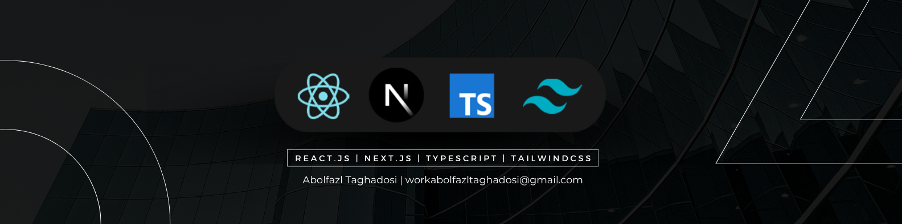

## About me

Hello! my name is "Abolfazl" and I'm 19 years old. I'm a Software engineer and i like cybersecurity, reverse engineering, and overall system-level stuff, but currently I'm focused on Front-end development. I work with both JavaScript and TypeScript (mostly TypeScript). I have skills in React, Next.js, Tailwindcss and Three.js.

- 🌍 I'm from Mashhad (Iran)
- 🖥️ Checkout my [Portfolio](https://abolfazl-taghadosi.vercel.app/)
- ✉️ You can contact me at [workabolfazltaghadosi@gmail.com](mailto:workabolfazltaghadosi@gmail.com)
- 🌱 I'm learning Three.js

## Top Skills

    <b>Languages & Core Web:</b> HTML5 – CSS3 – SASS – JavaScript (ES6+) – TypeScript  
    <b>Frameworks & State Management:</b> React – Next.js – Three.js – Redux/Redux-Toolkit – Zustand– Recoil – TanStack Query (React Query)  
    <b>UI & Animations:</b> Bootstrap – Tailwind CSS – Material UI – ShadCN UI – GSAP – Framer Motion  
    <b>Testing, Tools & Other:</b> Jest – React Testing Library – Vitest – Progressive Web Apps (PWA) – Drizzle ORM – Prisma – Git – GitHub

## Projects

- [MelodiMix (Spotify clone)](https://melodi-mix.vercel.app)
- [Lingo (Language leaning app)](https://charactermi-lingo.vercel.app)
- [Filmhub](https://charactermi.github.io/film_hub)
- [Design-Wave (Canva clone)](https://design-wave.vercel.app)
- [GTA VI landing](https://charactermi.github.io/gta-vi)
- [Gym Lovers](https://charactermi.github.io/gym-lovers)
- [ATB Media](https://charactermi.github.io/atb_media)
- [Marble Race Game](https://charactermi.github.io/marble-race)
- [Car Game](https://charactermi.github.io/car-game)

## Socials

let me know if you have any questions or feedback :

    
    
    
    

