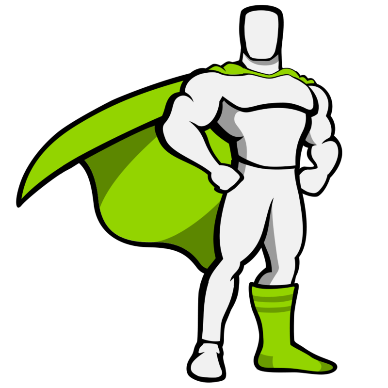

  

# About Me

## About me

### Hi there 👋🏻 My name is Abolfazl, I'm a front-end developer.

I'm 18 years old and I'm a web developer with skills in HTML, CSS, JavaScript, TypeScript and frameworks like TailwindCSS, Next.js and Three.js. I am currently learning Three.js and I'm excited to continue expanding my knowledge in the field of web development.

- 🌍  I'm based in Mashhad (Iran)
- 🖥️  See my [Portfolio](https://charactermi.github.io/first-portfolio/)
- 🖱️ And my second [Portfolio](https://charactermi.github.io/second-portfolio/)
- ✉️  You can contact me at [abol1385fx@gmail.com](mailto:abol1385fx@gmail.com)
- 🧠  I'm learning NextJs

## Top Skills

    
    
    
    
    
    
    
    
    
    
    
    
    
    
    
    

## Projects

- [Lingo (Language leaning app)](https://charactermi-lingo.vercel.app)
- [Filmhub](https://charactermi.github.io/film_hub)
- [Design-Wave (Canva clone)](https://design-wave.vercel.app)
- [MelodiMix (Spotify clone)](https://melodi-mix.vercel.app)
- [Gym Lovers](https://charactermi.github.io/gym-lovers)
- [ATB Media](https://charactermi.github.io/atb_media)
- [Marble Race Game](https://charactermi.github.io/marble-race)

## Languages

## Socials

let me know if you have any questions or feedback :

    
    
    
    

